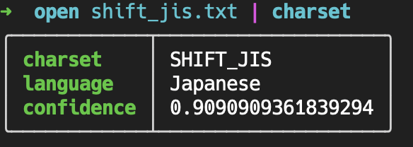
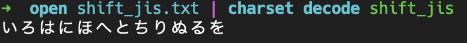
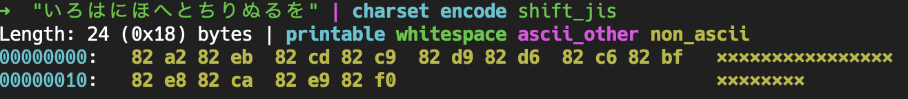

A [nushell](https://www.nushell.sh) plugin for converting charsets.

### Usage

* Use `charset` to detect charset of input.
    

* Use `charset decode` to convert input to utf string.
    

    or convert to a given charset
    

* Use `charset encode ENCODING_NAME` to convert utf string to a given charset
    